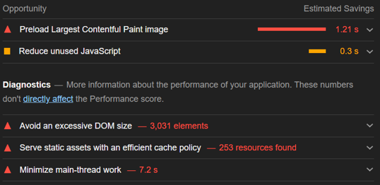
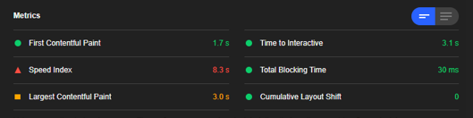
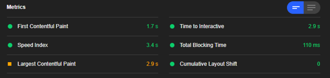
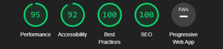
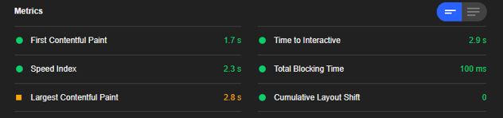

# Frontend Mentor - REST Countries API with color theme switcher solution

This is a solution to the [REST Countries API with color theme switcher challenge on Frontend Mentor](https://www.frontendmentor.io/challenges/rest-countries-api-with-color-theme-switcher-5cacc469fec04111f7b848ca).

## Table of contents

- [Overview](#overview)
  - [The challenge](#the-challenge)
  - [Screenshot](#screenshot)
  - [Links](#links)
- [My process](#my-process)
  - [Built with](#built-with)
  - [What I learned](#what-i-learned)
  - [Continued development](#continued-development)
  - [Useful resources](#useful-resources)
- [Acknowledgments](#acknowledgments)

# Overview

## The challenge

Users should be able to:

- See all countries from the API on the homepage
- Search for a country using an `input` field
- Filter countries by region
- Click on a country to see more detailed information on a separate page
- Click through to the border countries on the detail page
- Toggle the color scheme between light and dark mode _(optional)_

## Screenshot

## Links

- Live Site URL: [REST Countries API with color theme switcher solution](countries-api-h.vercel.app/)

# My process

## Built with

- [React](https://reactjs.org/) - JS library
- [Tailwindcss](https://tailwindcss.com/) - For styles
- axios - For HTTP request
- [react-render-if-visible](https://github.com/NightCafeStudio/react-render-if-visible) - To render large list

## What I learned

I started this project with two goals: improving my React skill and building performant web app. Hence, I run a Google Lighthouse audit after building the app.

The initial score was as follows:




### _Problems & Solutions:_

- Avoid an ecessive DOM size + Minimize main-thread work  
  The homepage displays a list of 255 countries, which resulted in ecessive DOM size. Google Lighthouse suggested using a 'windowing' library like [react-window](https://github.com/bvaughn/react-window). However, you can't create a responsive grid using this library. So, I searched for alternatives and found [RenderIfVisible](https://github.com/NightCafeStudio/react-render-if-visible) which worked like a charm.

  - Performance score increased by 15%

  

  

- Reduce unused JavaScript  
  I setup route-based code splitting using React.lazy, coupled with Suspence component to provide a loading indicator while the component load.

  ```JavaScript
  const Home = lazy(() => import("./components/Home"));
  const CountryDetails = lazy(() => import("./components/CountryDetails"));
  ```

  ```jsx
  <Suspense fallback={<Loader />}>
    <Switch>
      <Route exact path="/">
        <Home />
      </Route>

      <Route path="/countries/:name">
        <CountryDetails />
      </Route>
    </Switch>
  </Suspense>
  ```

  - Performance score increased by 12%
  - Speed Index time reduced by 6 seconds

  

  

- Preload Largest Contentful Paint image  
  To reduce Largest Contentful Paint (LCP) time, I preloaded above-the-fold images.

  ```html
  <!-- Preload above the fold images -->
  <link rel="preload" as="image" href="https://restcountries.eu/data/afg.svg" />

  <link rel="preload" as="image" href="https://restcountries.eu/data/ala.svg" />
  ```

  - Performance score increased by 2%
  - Largest Contentful Paint time reduced by 0.3s
  - Time to Interactive reduced by 0.1s (I learned that even a split sec makes a difference XD)

  

  

  Or this is how it was before [restcountries.eu](https://restcountries.eu) shut down suddenly. It seems [restcountries.com](https://restcountries.com) uses a slow server, so the score dropped when I used preloading resources. Once I find a better solution, I'll update this README file.
